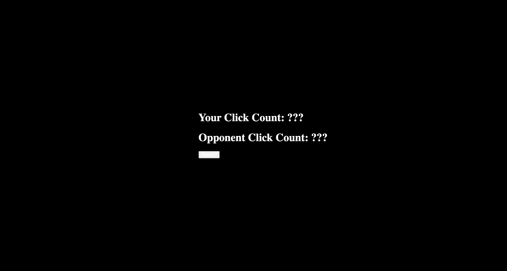
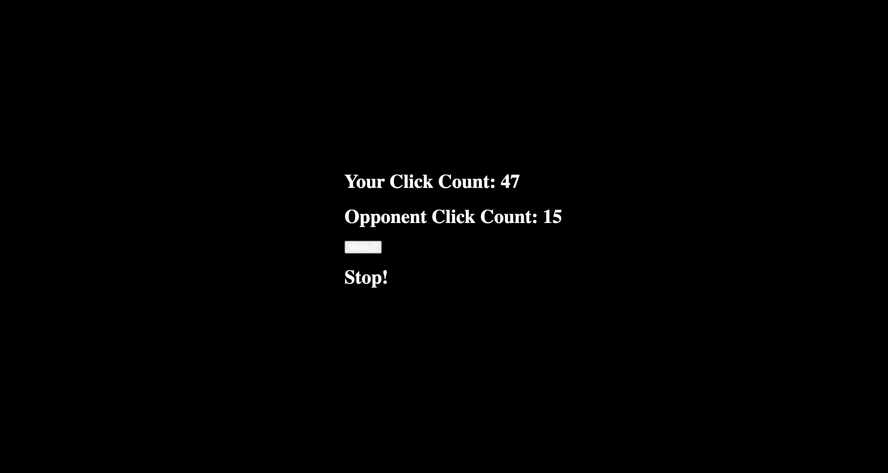

Write up a README file that includes the names of all of your group members and a description of what the application does. Be sure to list anything a user might need to know before using your application. Also describe any challenges your group faced.

Names: Grace Robinson and Lucas Marble

Description: This application is a small click game that allows two players to go head to head against eachother. In this game, there are click counts for both users that appear on the screen. These counts are initially set to 0 but once both players are ready, the players must click the screen as many times as they can before the time runs out. To start the game, both players must click the ready button and once the go message is displayed on the screen, start clicking. Once the time runs out, a message is displayed for the user to stop and any clicks after that point will not be counted. The click count for yourself and your opponenet will be displayed on the screen. We were able to add a fun component that keeps the number of clicks for both players a secret until the game is over! The biggest challenege we faced was trying to figure out how to set it up, but once we figured that out, all went well!

Images of the application:

